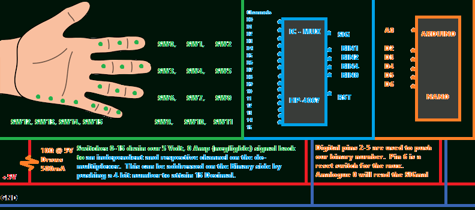
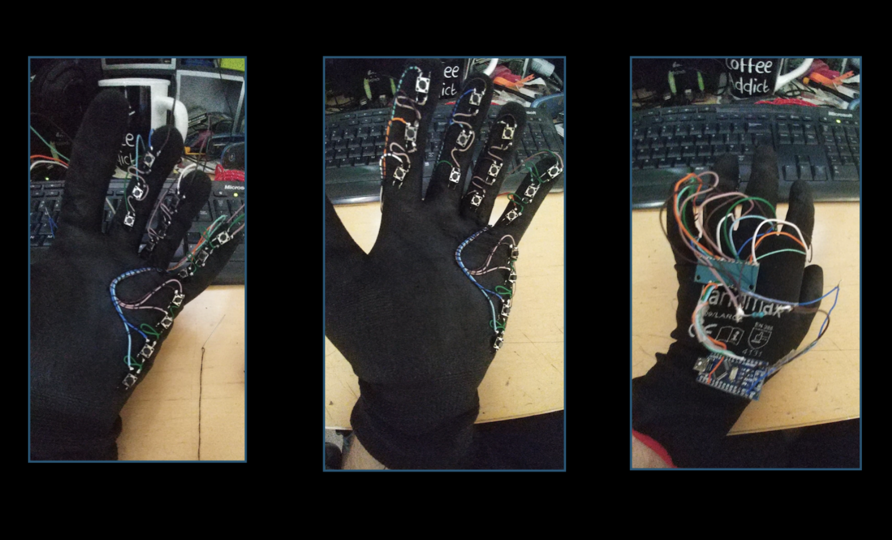

# DEAFBLIND 

 

## BACKGROUND

- Why they are the most underserved community...
- Wearable ins general

## GENERAL NOTES
 
- Rapid prototyping
- Broad skillset & vast range of paths to go down
- Expectation is not to explore and complete all paths, but to evaluate, choose and produce a prototype.
- Interest has been high, including council and government.
- Even once complete, implementation, social adoption will be a big element

# SCOPE & APPLICATIONS

- DeafBlind support glove
- DeafBlind Elderly support glove
- MetaVerse haptic research
- Coding Development Glove (For ADHD assist)  

## ROADMAP 

1. Preliminary investigation
	- Determine which equipment is needed
	- Produce a small report
2. Aparatus Testing
	- speccing
	- scoping
3. Initial Prototype design
	- High level 
		- Need these chips, equipment etc
		- Need to program x,y,z
		- Need to develop a,b,c intermediary languages/processes etc
4. Component build, test deploy
	- prove out  functionality of each part 
	- Integration build and test
5. Final product

# TECHNICAL
 
 - Buttons and switches
 - Integrated Circuitry 
 - Touch sensitivity input 
 - Vibrational feedback
 - Input/Output Consolidation 
 - Signal processing
 - Translation Algorithms 

# FUNDING 

# POTENTIAL 

# Rationale & Problem Statement  

There are over 300,000 people that are registered as DeafBlind in the UK alone who
suffer from both visual and auditory impairment at the same time. As a result, they
have little to no means of communication with others, they are extremely isolated,
additionally the deaf blind community are seriously underserved in terms of accessible
support technology. This means they have no ability to go online, enjoy popular media
or communicate electronically. They are fully reliant on highly trained carers and as a
result have little contact with the outside world.

# Project Undertaking & Proposal  

This project will involve the design, test and build a digital tactile communications
glove with I/O feedback capabilities. This glove is to be designed so the user can type
out messages via their fingers with their thumbs in a natural manner. Signals will be
fed-back via pulses to a localised microprocessor, which converts into byte stream and
translates into desired media (i.e., SMS, email, Audio & keyboard input).
This technology would open up a new critical benefit for both the death-blind and the
blind community - unlike braille, which is a form of active reading, the digital Glove
would enable consumption of books, movies, internet chat via tactile pulses (such as
rumble motors) – which is a form passive reading similar to watching or listening to
media. As such a story or movie would ‘play’ on the glove, making media far more
accessible.

In summary, deaf blind individuals would be able to go online, read emails, talk to
people in real time and reduce their reliance on highly trained care workers.
This project gives the candidate a chance to work on a high potential technology
platform, with close parallels such as Meta’s (formally Facebooks) haptic glove for
VR interactions.  

# Opportunities  

This project is highly technical and hands on with broad scope for learning and
gaining industry relevant experience on:
- Coding: C++, Python with potential scope for JavaScript.
- Electronics such as circuit design, build and deploy with a large focus on finding
innovative ways to miniaturise and optimise.
- Integration Testing: Industry standard methodologies in hardware optimisation with
Raspberry Pi, Arduino’s and software delivery.
- Product Design: Software and Hardware Architecture iteration.
- UX Design:
- App Development: Back-end and web development.
- Business Development: VC Prototype Pitching, Supply Chain acquisition,  

Marketing, Logistics, Government/Council engagements.
Candidate will have access to technical guidance and assistance from the head of this
project - but the scope and complexity means the candidate should possess a passion
for hands on practical driven outcomes. Technical iterations, write-ups and stand ups
will be coordinated via industry standard Agile Methodology with the project Lead.
  

# Funding
There is some scope for remunerations, subject to completion of the project (but does
not assume the delivery of the end product).  

# Project Flexibility  

Initial product designs and research are a platform for the candidate to develop, but
there is full scope for design overhaul but would be subject to the agreement of the
project lead and candidate. For example a coding glove that integrates visual
recognition could be pitched - subject to approval.

# More Information  

Project Site: https://murchie85.github.io/projects/deafblind/index.html  
Deaf Blind UK: https://deafblind.org.uk/  
Tactile Signing: https://en.wikipedia.org/wiki/Tactile_signing  
Key-Words: ASL, Finger Spelling, Haptic Feedback, Digital Braille